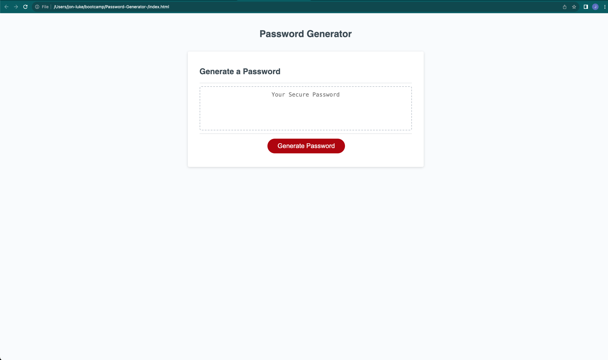

# Password-Generator-

## Description

My movtivation for this project was to create a random password generator for an employee with access to sensitive data.
This will help create a strong password that provides greater security.
I learned the basics of javascript including arrays, for loops, if statements, how to define a variable, and how to generate random numbers.

## Installation

N/A

## Usage

To use this password generator, simply go the website and click "Generate Password." 
Once you have done that you will be prompted with questions regarding what kind of characters you would like in your password.
Simply press "OK" if you would like those charcters or "Cancel" if you don't want those characters.
Once you have answered all the questions you will be prompted with a password.

## Links

Link to Deployed App: (https://jlj98.github.io/Password-Generator-/)

## Credits

I used outside sources for help with arrays, for loops, and generating random numbers including ASKBCS, Xpert Learning Assistant, and ChatGPT.
I watched this YouTube video for help with understanding the assignments end functionality: https://www.youtube.com/watch?v=x4HUaiazDes

## License

Please refer to the LICENSE in the repo.

